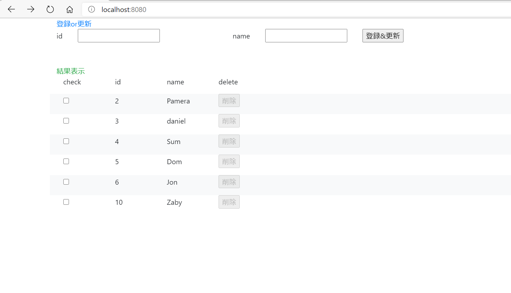

# Spring SampleApplication

## sampleProject01

## Spring + Maven + JPA + Thymeleaf + Mysql

### pom.xml
2.3.3.RELEASE
java 11
spring-boot-starter-web
spring-boot-starter-thymeleaf
spring-boot-starter-data-jpa
mysql-connector-java
org.projectlombok
spring-boot-starter-test
junit-vintage-engine
org.webjars bootstrap4.5.2 jquery3.4.1
#### 機能
CRUD
SPA
結果表示のレイアウトを見やすく　背景を奇数と偶数で分ける
削除ボタン非活性、活性　チェックボタン押下時に削除実行

##### 感想
簡単なSQLの処理には向いているが複雑になればなるほど難しい。
JpaRepositoryを継承することで用意されているメソッドを使える
全件検索　更新　削除　などなど。。

## sampleProject02
## Spring +Gradle + MyBatis + Thymeleaf + MySql

### build.gradle
2.3.3.RELEASE
java 14
'org.springframework.boot:spring-boot-starter-thymeleaf'
'org.springframework.boot:spring-boot-starter-web'
'org.mybatis.spring.boot:mybatis-spring-boot-starter:2.1.3'
'org.projectlombok:lombok'
'org.webjars:jquery:3.5.1'
'org.webjars:bootstrap:4.5.2'
'mysql:mysql-connector-java'
'org.projectlombok:lombok'
'org.springframework.boot:spring-boot-starter-test'
'org.junit.vintage','junit-vintage-engine'
